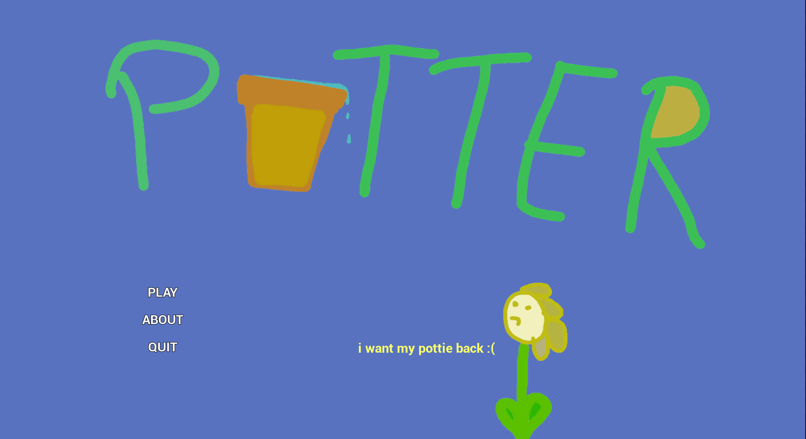
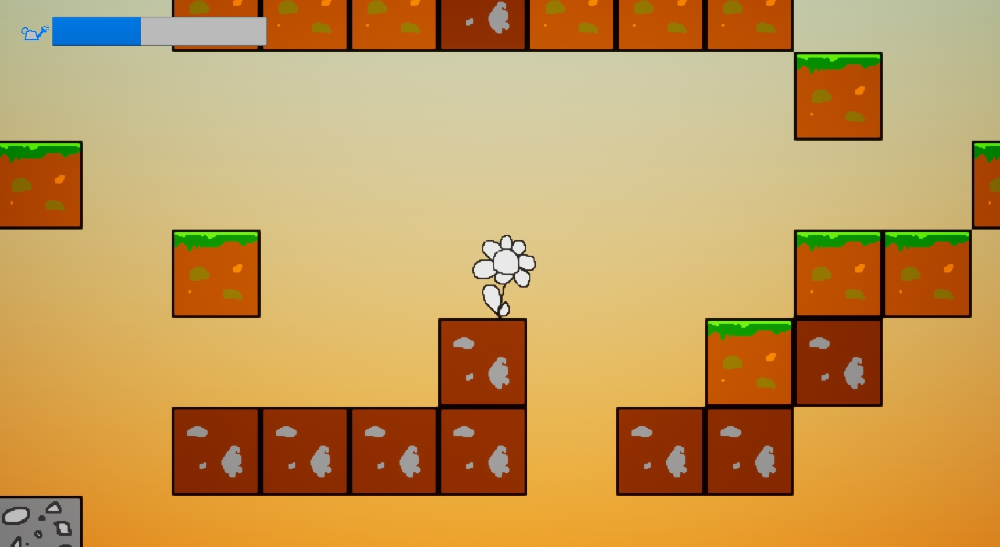
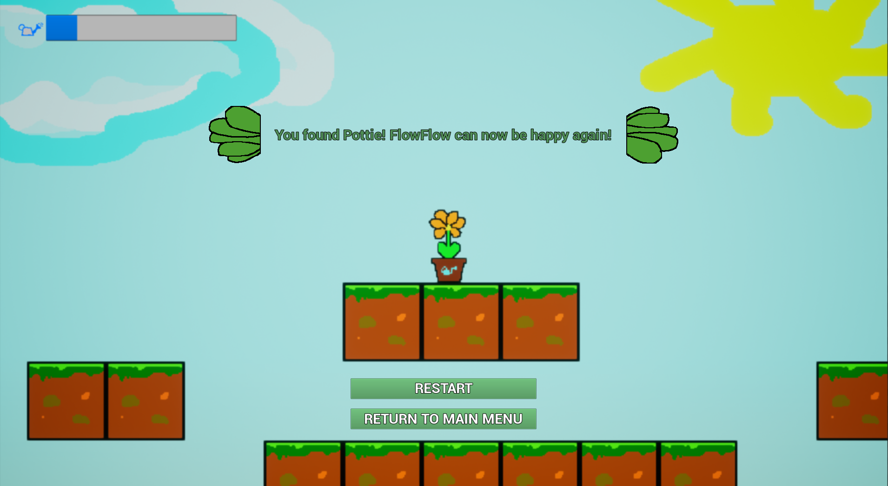

# Potter

This is a game about a flower named FlowFlow who lost his best friend Pottie. You need to help FlowFlow find his friend as quickly as possible because he simply cannot live without him.

This is the first real game I made with Unreal Engine 4 (v4.22) as well as my first ever participation in a game jam. It was my submission to the [Geta Game Jam 7](https://itch.io/jam/geta-game-jam-7).

During a university project, I added test code as well as a Jenkins (v2.176.1) pipeline.

**Key reference:**

| Key                   | Action    |
| --------------------- | --------- |
| W / Up Arrow / Space  | Jump      |
| A / Left Arrow        | Go left   |
| D / Right Arrow       | Go right  |

